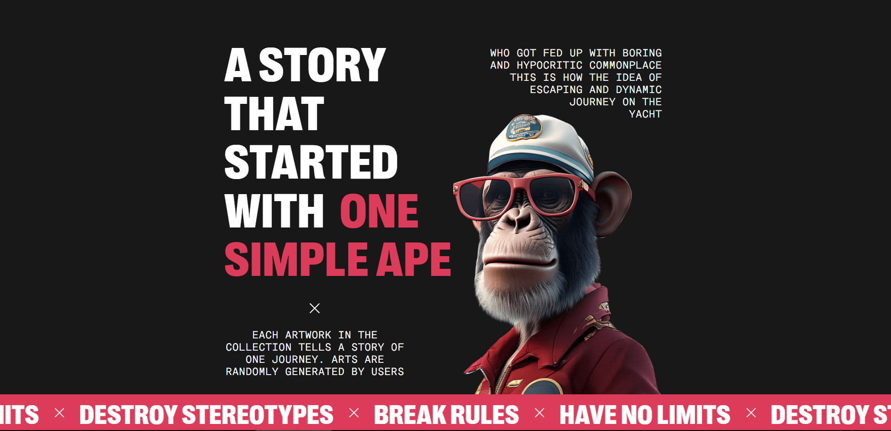
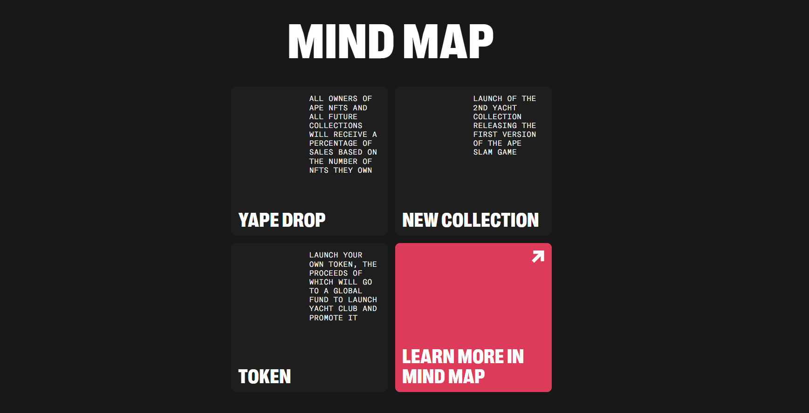
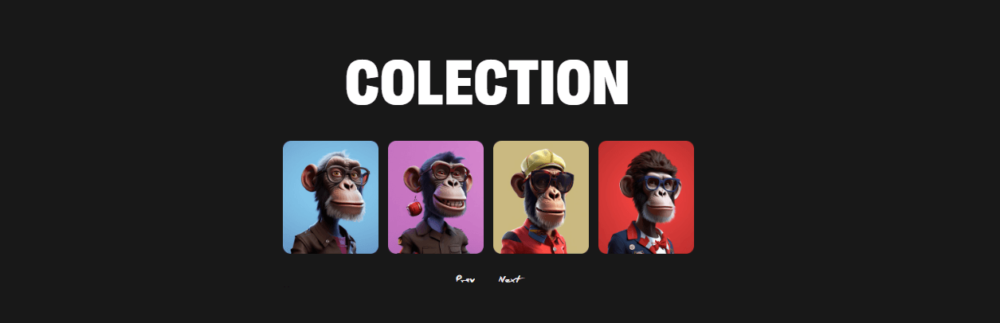
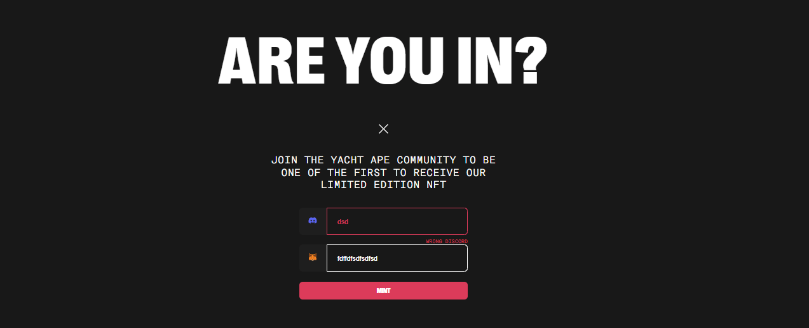

## Ape NFT

"Ape NFT" is the best platform for getting exclusive APEs!Don't lose your time!
[Site on Github Page](https://bajmutov.github.io/Ape-NFT/).

## Features

#About

1. Developed a story about Simple APE and Banner include a “moving line”
   animation. 

#MIND map

1. Developed layout using CSS Grid (Tab and Decktop). In the mobile version, the
   cards are in the slider.
   

#FAQ

1. Developed accordion with FAQ.
2. Only one answer can be open at the same time.
3. The color of the question and numbers changes after openning and a background
   (and image on all screens except mobile) appears. When hovering or focusing,
   only the color changes.
   

#Arts

1. Developed image slider. Clicking or dragging causes one slide to be scrolled.
   (Used Swiper js library).
   

#Contact

1. Developed form for JOIN THE YACHT APE COMMUNITY
   

## Technologies Used

- HTML5, CSS3, JS, React, Git, gh-pages

## Getting Started

1. Clone the repository: `git clone https://github.com/bajmutov/Ape-NFT.git`
2. Install dependencies: `npm install`
3. Run the application: `npm run dev`
